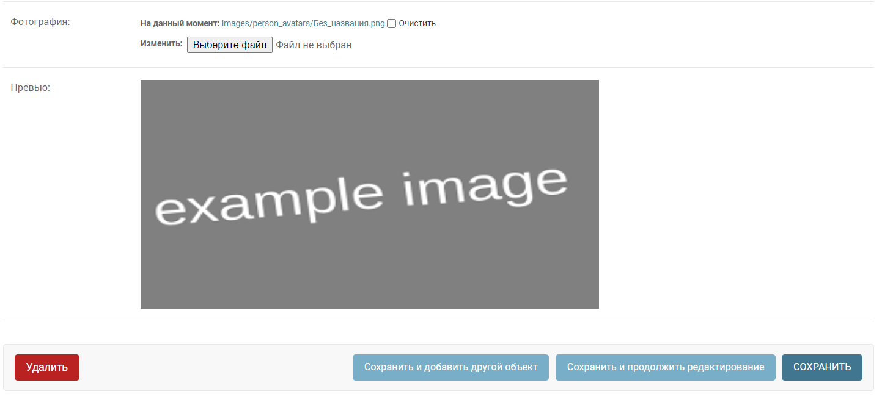
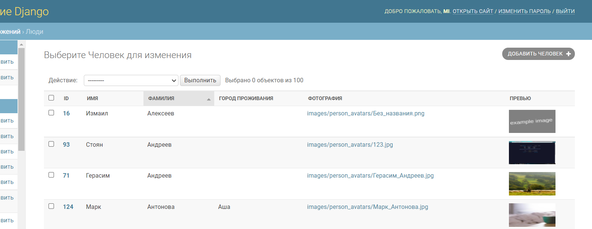

**Как подключить превью в админке:**

**Инструкция**

1. Импортируем миксин
```python
from apps.core.utilities.mixins import AdminImagePreview
```

2. Применяем параметры в admin.ModelAdmin

```python
list_display = ("image_preview_list_page",)
readonly_fields = ("image_preview_change_page",)
```

**_image_preview_list_page_** - функция для вывода превью на общей странице
**_image_preview_change_page_** - функция для вывода превью на странице редактирования


_Пример:_

```python
class FooAdmin(AdminImagePreview, admin.ModelAdmin):
    list_display = ("image_preview_list_page",)
    readonly_fields = ("image_preview_change_page",)
```
**Страница редактирования**

**Общая страница**
